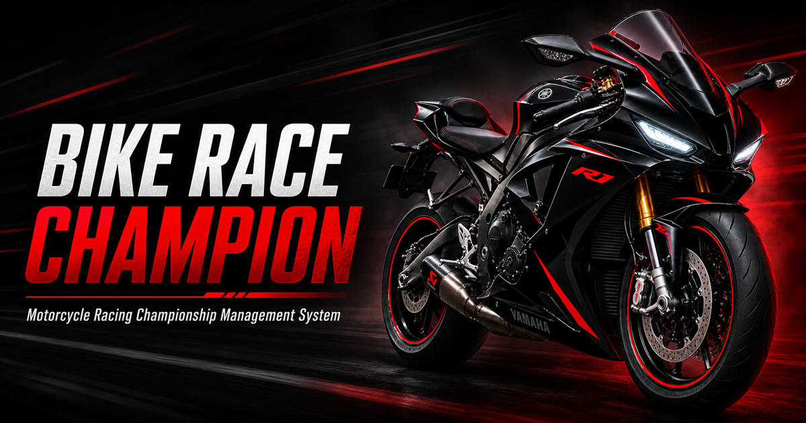

# Bike Race Champion Portfolio

## Live Website

https://ghanemsadek2-lang.github.io/Bike-Race-Portfolio/

## Project Overview

Bike Race Champion is a Java desktop application for managing motorcycle racing championships efficiently. It supports structured administration of riders, teams, seasons, races, registrations, results, standings, and AI-assisted user guidance.

## Main Features

- Riders & Teams Management
- Races & Seasons Management
- Registration Management
- Results & Standings
- AI Race Assistant
- Admin and User interfaces

## Technologies Used

- Java
- Java Swing
- Microsoft SQL Server
- JDBC
- Gemini AI
- HTML & CSS

## Demo

The portfolio includes a short demo video. The full system contains additional features and management modules.

## Developed By

Sadek Ghanem  
Computer & Communications Engineering Student
